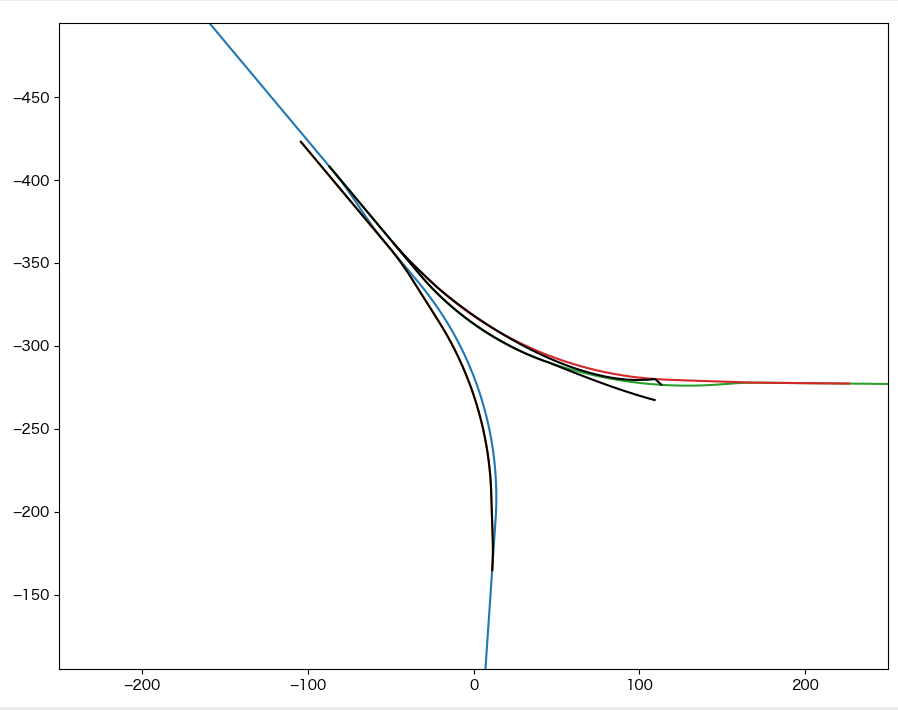
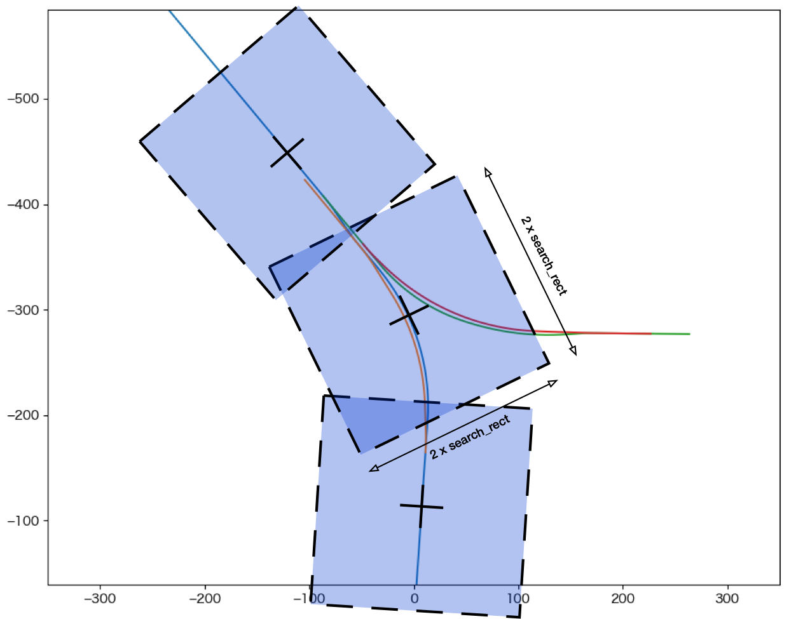
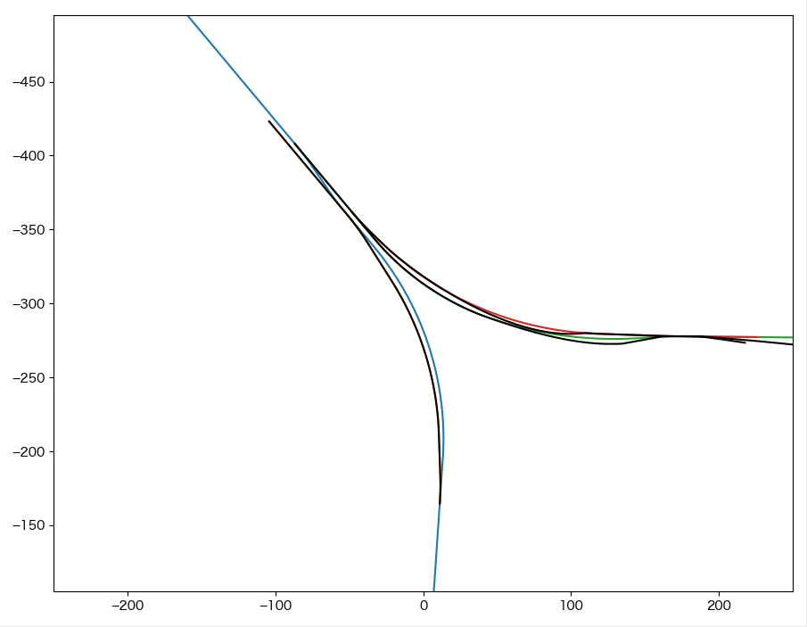
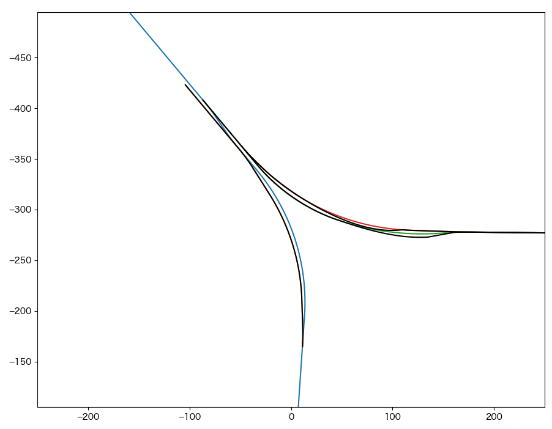
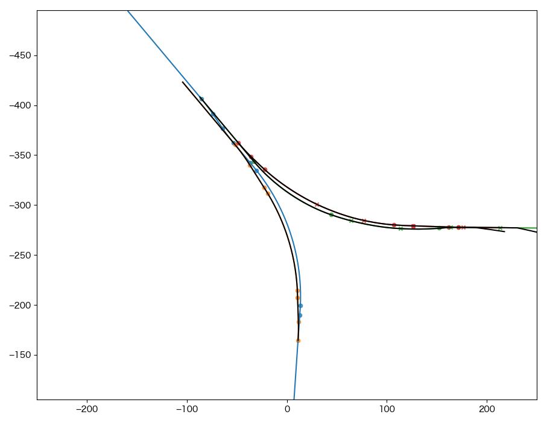

=================
他軌道構文の出力
=================

メインウィンドウ右下の **Generate** ボタンをクリックすると、tateyama_up軌道を自軌道として各軌道を他軌道構文(Track)に変換する。

他軌道への変換結果はmain.cfgと同じディレクトリのresult以下に保存され、同時にプロットウィンドウに黒線で表示される。

- 出力ファイル一覧

  - result/

    - tateyama_down_converted.txt
    - honsen_down_converted.txt
    - honsen_up_converted.txt
    - owntrack/

      - tateyama_up.txt

	- 入力ファイルのtateyama_up.txtに対して、各々の距離程を[@TSUTSUJI_GENERAL]セクションのoffset_distanceだけシフトしたもの

search_modeの設定
==================

変換結果を見ると、honsen_up, honsen_down軌道がおおよそx > 100 mの領域で出力されていないことがわかる。
これは、ver. 1.9.0以降では、次図のように自軌道(ここではtateyama_up)を中心とした一定の範囲にある軌道のみを他軌道構文への変化対象とする :ref:`search_mode=2 <cfgformat_gene_search_mode>` がデフォルトで有効となっていることによる。
変換対象を探索する範囲は、自軌道基準点から±search_rect [m] (デフォルトでは±100 m)となる。

より広い範囲のhonsen_up, honsen_down軌道を変換対象とするために、search_rectにより大きな値(ここでは250m)を指定して変換対象となる範囲を広げてみる。
main.cfgを下記のように変更して、データリロードののちGenerateを実行すると、下図のように分岐器の先まで変換された結果が得られる。

.. code-block:: text
   :caption: main.cfg
   :emphasize-lines: 6,7

   [@TSUTSUJI_GENERAL]
   owntrack = tateyama_up
   unit_length = 1
   origin_distance = 0
   offset_variable = hoge
   search_mode = 2
   search_rect = 250
   ...

また、search_mode=1としてver. 1.8.2以前の計算モードを有効とすることで、自軌道からの距離によらず全ての計算対象とすることもできる。
この場合のmain.cfgは下記のようになり、データリロードの後Generateを実行すると、下図のように軌道終端まで変換された結果が得られる。

ただし、search_mode=1では自軌道からの距離にかかわらず全ての軌道を対象として変換処理を行うため、大規模なマップでは処理に長時間を要する可能性がある。
特別の事情がないかぎりはsearch_mode=2を基本として、search_rectの値を調整することをおすすめする。

.. code-block:: text
   :caption: main.cfg
   :emphasize-lines: 6

   [@TSUTSUJI_GENERAL]
   owntrack = tateyama_up
   unit_length = 1
   origin_distance = 0
   offset_variable = hoge
   search_mode = 1
   ...

.. note::

   search_mode, search_rect は[@TSUTSUJI_GENERAL]セクションの他、各軌道セクションに記述することもできます。
   これを用いて、自軌道から大きく離れたところに位置する軌道に対してのみ特定のsearch_modeやsearch_rectを適用して、必要以上に処理時間を延ばさないような工夫ができます。

supplemental_cpの設定
=====================

変換結果を見ると、honsen_up, honsen_down軌道について一部入力データからの乖離が大きい部分がある。

tsutsujiでは、入力軌道データの自軌道要素(Curve, Gradient)が存在する距離程の座標を抽出して他軌道構文に変換している。
このため、距離の長い曲線区間では距離程どうしの間隔が開くことがある。
また、変換しようとしている軌道と自軌道のなす角が開いている場合、相対半径によるTrack要素間の補間がうまく働かない場合が多い。

このような場合は、main.cfgファイルの該当する軌道セクションにsupplemental_cpを追加する。
supplemental_cpがセットされると、自軌道要素が存在する距離程に加えて、supplemental_cpで指定した距離程に対する座標を基に他軌道構文への変換を行う。

main.cfgを下記のように変更して、データリロードののちGenerateを実行すると、下図のように最終的な変換結果が得られる。
なお、この図ではsupplemental_cpを設定した座標にx印、Curve要素を設定した座標にo印を表示している。

.. code-block:: text
   :caption: main.cfg
   :emphasize-lines: 12, 24
		     
   ...
   [honsen_down]
   file = honsen_down.txt
   absolute_coordinate = False
   parent_track = tateyama_up
   origin_kilopost = 438
   x = 0
   y = 0
   z = 0
   angle = -180
   endpoint = 400
   supplemental_cp = 200, 250, 300, 350

   [honsen_up]
   file = honsen_up.txt
   absolute_coordinate = False
   parent_track = honsen_down
   origin_kilopost = 60
   x = 0
   y = 0
   z = 0
   angle = 0
   endpoint = 300
   supplemental_cp = 100, 150, 200, 250

.. note::

   supplemental_cpを追加することで破綻の少ない他軌道データが得られるが、ここにRepeater要素でレールオブジェクトを割り当てると、うまくspan, intervalを調整しない限り、結局は隙間だらけのレールが生まれてしまう。Tsutsuji上での変換結果だけにこだわらず、Bve Trainsim上で満足する結果が表示されるよう、変換結果を活用して欲しいと思う。
   
このチュートリアルは以上です。
   
