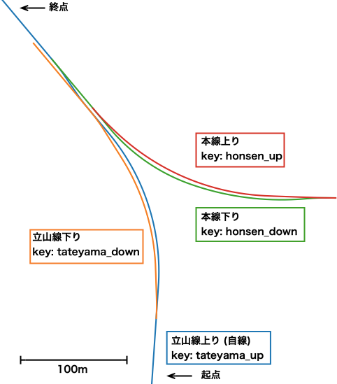

=======================
Creating Terada Station
=======================

Introduction
============

Here, we explain the procedure for creating track alignment data from the Geospatial Information Authority of Japan (GSI) aerial photos, using the `Toyama Chihou Railway Terada Station <https://www.chitetsu.co.jp/?station_info=寺田駅>`_ as a case study.

In this tutorial, we will build the Tateyama Line up-track as the main own-track, and construct the Tateyama Line down-track, Main Line up-track, and Main Line down-track relative to it. The map layout is shown below.

You can download the sample data from :download:`terada_sample.zip (3 KB) <./files/terada_sample.zip>`.

.. note::

   The maps and aerial photos shown in this document are processed based on GSI Standard Maps and GSI Seamless Aerial Photos.
   
Table of Contents
=================

.. toctree::
   :numbered:

   ./preparecfg
   ./tateyama_up
   ./tateyama_down
   ./honsen_down
   ./honsen_up
   ./generatetracks
